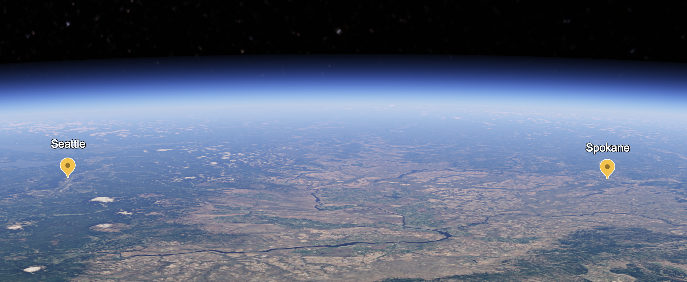
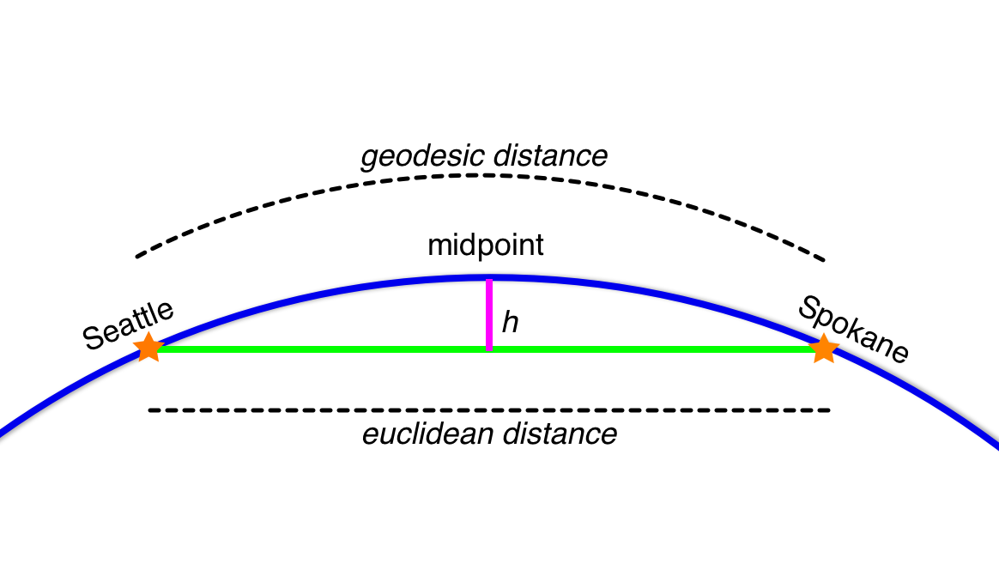
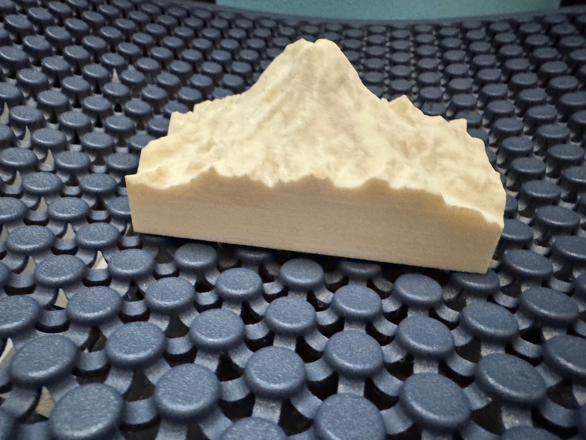
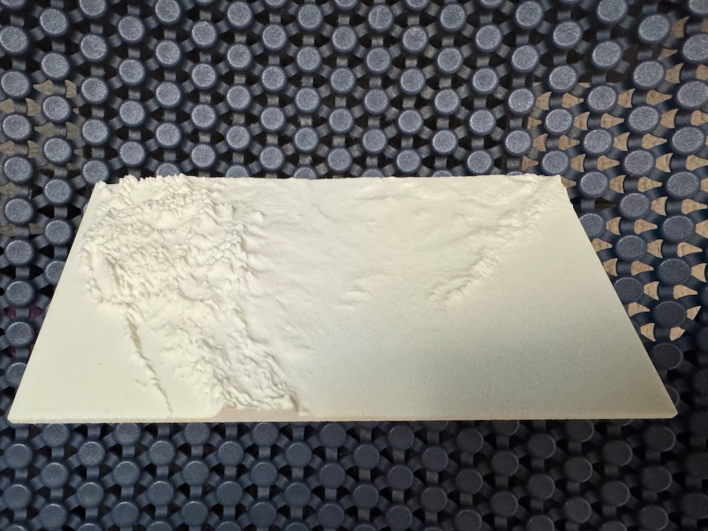

# Is including the curvature of the Earth in a relief map interesting?
4 Feb 2025

I've been thinking about 3D printing terrain again and maybe even reviving my old relief map generator, Topophile.  Today I worked through one question that could lead to new features.

Would it be interesting to print a terrain model that included the curvature of the Earth in its depiction of elevation? 

Normal terrain models flatten the curvature of the Earth.  Each point on a terrain map shows the altitude from an imaginary round earth and then flatten (or project) these points onto a flat surface.

If you **un**project the data you'd make a model that rises from one side of the model to the middle, and then falls back down to the other edge of the model.  But how does that rise and fall compare to other features?

I did some math to find out.  **tl;dr: mostly, no, at least not by itself**.

## First, how?

This is a fun question because I didn't know how to answer it.

I knew how to print projected elevation data, but I didn't know how to revive the roundness of the planet.  I needed new tools, I didn't have the right vocabulary to accurately describe what I was trying to do.  I knew datums were used to describe the roundness of the earth and coordinates on it, but it took some research to pull together the right tools.  

I could use coordinate systems that describe the earth in different terms and transformers that can do the math to change between them to solve this problem.

[pyproj](https://pyproj4.github.io/pyproj/stable/) is a Python library that understands Coordinate Reference Systems (CRS) and can do coordinate transformations.  

EPSG:4326 is a CRS that describes the Earth as an ellipsoid (a 2 minute description of ellipsoids: [youtube](https://www.youtube.com/watch?v=QpqzUlnhWrE)) and points are described as latitude, longitude, and altitude.  This is commonly how we talk about locations when we use GPS and maps.

EPSG:4978 is a CRS that describes points on the Earth in terms of x,y, and z coordinates, meters from the center of the earth.  There are more details to this, but these x,y,z coordinates would allow me to do some math to answer my question.

## An example

I started with an example of the distance between Seattle and Spokane.  A web search gives me latitude and longitude coordinates for the cities:

```
Spokane = [47.6580, -117.4235]
Seattle = [47.6061, -122.3328]
```

Here they are on the Earth:



Then I'll want the location that is exactly halfway between the two cities, this is computed by averaging the coordinates.

`[(Spokane[0]+Seattle[0])/2.0,(Spokane[1]+Seattle[1])/2.0]` is `[47.63205, -119.87815]`

I'll call this the Geodesic midpoint because it's the midpoint on the globe's surface.

A normal relief map flattens the globe, it projects data on to a flat surface from edge to edge.  My "unprojected" map will start at its edges with no elevation added due to the globe's curvature.  But moving toward the middle of the map, the curvature of the globe will arc up and assuming a spherical globe for simplicity, the midpoint will be the highest point.  I'll find this midpoint to understand if the elevation due to curvature is interesting.

I'll measure the height due to curvature by drawing a line directly from Seattle to Spokane underground and measuring the distance between that underground line and the midpoint above on the globe's surface.

## Working out

Let's convert the lat, lon coordinates into x,y,z space (EPSG:4362 -> EPSG:4978):

```
Seattle is (-2304161.755165583, -3640208.011898156, 4687459.200834844) 
Spokane is (-1982221.1320947849, -3820256.377755666, 4691347.81505322) 
Geodesic Midpoint is (-2145080.7566399984, -3733703.9817224736, 4689403.986258284)
```

Using the same midpoint calculation, but with the x,y,z coordates, we can get the Euclidean midpoint:

```
Euclidean Midpoint is (-2143191.443630184, -3730232.194826911, 4689403.507944033)
```

Now we can use the Pythagorean therorem for 3D points to compute the distance between the Geodesic Midpoint and the Euclidean Midpoint, it looks like this in Python:

```
def euclidean_distance(p1, p2):
    return math.sqrt((p2[0] - p1[0])**2 + (p2[1] - p1[1])**2 + (p2[2] - p1[2])**2)
```

And we get a max height of **3.95 kilometers**.

This sounds big, but let's think about it in terms of a 3D printed relief map.  Keeping the map proportional, Seattle to Spokane is 369km, so the vertical change in elevation would be just over 1% of the model's width, it wouldn't be noticable.

A common trick in making large relief maps is to increase the vertical scale (elevation) while leaving the horizontal scale (north-south-east-west) unchanged.  If we used a 10x elevation scale, the contribution from the curve of the earth would now be over 10% and might be noticable.

So this is something to think about for the future on larger models.

## A smaller example

Topophile was mostly used to print smaller features like a city or a mountain, like this:


photo: a vertically exagerated Mount Rainier.

 They tend to have larger elevation changes making them more interesting.  Would the curvature be interesting here?  Intuitively I don't think so, but since I have the computations already figured out, it doesn't cost much to check.

The NW and SE corners of Mount Rainier National Park are approximately 

```
NW Corner: (46.99662, -121.91608) 
SE Corner: (46.76991, -121.44742)
```

And they are 43.7 km apart.  Doing the same math as above, the curvature contributes 59 meters of elevation at the mid point.  Mount Rainier is 4392.5m high and the contribution from the curvature is again about 1%.


But the park is more dramatic, varying from a low of less than 500m to the peak and back down quickly, if we were to increase the elevation scale, the curvature would be lost to the greatly exagerated volcano.

## What's next?

I'll be curious to give this a try on a very large map, one the size of a US State or Continent.  It's not likely to increase understanding, but it could look cool.


photo: a vertically exagerated 3D relief map of portions of North America.